# Donna (FromDonna) — Technical Architecture Design Document

**Author:** Chitti (from product architecture + monorepo)  
**Date:** 2026-07-26  
**Status:** Draft (as-built)  
**Version:** 1.0  
**Repo:** `ojassurana/FromDonna` (`/home/ubuntu/FromDonna`)

---

## 1. Executive Summary

**System purpose:** Donna is a multi-tenant personal AI agent product: each user gets a **real Hermes agent** in an isolated E2B sandbox. **Telegram** is the primary reach channel. **Cloudflare Workers** are the edge wire (routing, secrets, Bot API proxy, capability doors)—not the brain.

**Product invariant (non-negotiable):**

> Donna = a real Hermes agent. Telegram is how the user reaches it. The Cloudflare Worker is only a gateway proxy on top.

**Scale (current product shape):**
- Multi-user shared Telegram bot (`@fromdonna_bot`)
- **1 user → 1 primary E2B sandbox** (paused when idle)
- Inference via external providers (default **Grok 4.5**; Codex/other via llm-proxy catalog)
- Durable user files in **R2**; routing/session policy in **D1**

**Key challenges:**
1. One bot token / one webhook must feel like a private Hermes per user
2. Sandbox pause/resume latency vs “typing…” UX
3. Secrets never live long-term in user sandboxes (credential brokering)
4. LLM proxy must preserve tools / multipart / streaming fidelity

**Key decisions:**
1. Official Hermes **Telegram gateway runs inside the sandbox**, not as a Worker chat product
2. Real bot token stays Worker-only; sandboxes use **proxy tokens** + Bot API reverse proxy
3. Environment access is **tools-only** (ICM)—no auto-injected environment prose into prompts
4. Telegram **draft streaming is off** (final-reply reliability on multi-tool turns)

---

## 2. Requirements

### 2.1 Functional Requirements

| ID | Requirement | Priority |
|----|-------------|----------|
| FR-1 | User DMs shared bot → gets a private Hermes session with memory/tools | Critical |
| FR-2 | First message auto-provisions sandbox + routing without registration UI | Critical |
| FR-3 | Agent can use OAuth apps (Gmail/Drive/…) via Composio MCP door | High |
| FR-4 | Agent can call product HTTP APIs (e.g. Exa) via api-proxy | High |
| FR-5 | Agent can run CLIs in sandbox; keys injected via Worker stub/proxy when needed | High |
| FR-6 | User files/artifacts durable across sandbox death (R2 tools) | High |
| FR-7 | Idle sandboxes pause; next message resumes and continues same brain | High |
| FR-8 | Ops can wipe user data (sandbox + R2 prefix + composio + optional routes) | Medium |
| FR-9 | Marketing waitlist (`fromdonna.com`) and apply (`apply.fromdonna.com`) are **separate** surfaces | Medium |

### 2.2 Non-Functional Requirements

| Category | Requirement | Target / notes |
|----------|-------------|----------------|
| Isolation | Per-user compute | 1 E2B sandbox primary |
| Security | Channel token | Real TG bot token never in sandbox |
| Security | LLM/OAuth secrets | Worker/proxy vault only; capability HMAC |
| Reliability | Final Telegram reply | Streaming **disabled** in product template |
| Latency | Pre-typing gap | Dominated by resume + bootstrap; edge early typing optional |
| Fidelity | LLM door | OpenAI-compat with tools + multipart + tool_calls |
| Operability | Deploy | CF Workers independent of E2B template rebuild |

---

## 3. System Context

### 3.1 Context diagram

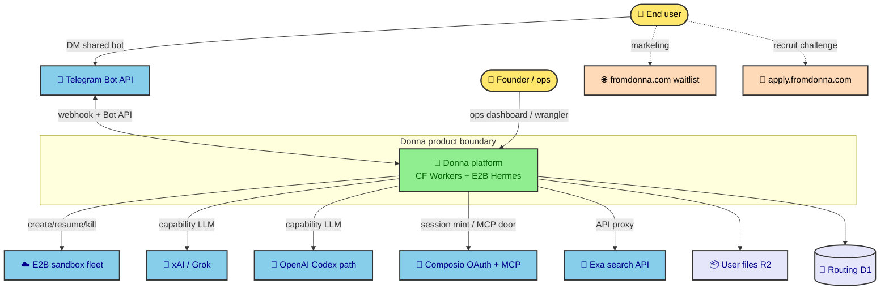

### 3.2 Stakeholders

| Stakeholder | Interest |
|-------------|----------|
| End user | Private PA that works in Telegram like a personal Hermes |
| Founders | Multi-tenant cost, isolation, ship velocity, no fake agent bridges |
| Ops / Chitti | Correct edge vs brain split; wipe/provision safety; latency |
| Recruit applicants | Separate apply challenge stack (not agent monorepo) |

---

## 4. High-Level Architecture

### 4.1 Style

**Multi-tenant edge + per-user agent VM:**

- **Edge (Cloudflare Workers):** webhooks, routing registry, lifecycle, credential brokering, Bot API reverse proxy
- **Compute (E2B):** full Hermes + official Telegram adapter + tools + `~/.hermes` brain
- **Doors (Workers):** llm-proxy, composio-proxy, api-proxy — sandbox never holds long-lived vendor secrets

**Why:**
- Hermetic per-user filesystem/memory without building a second agent runtime
- One shared bot token constraint solved by proxy tokens
- Clear security wall between edge secrets and user VMs

### 4.2 Container / component overview

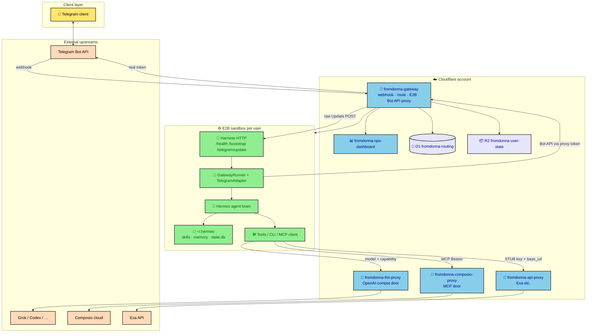

### 4.3 Ownership split

| Layer | Owns | Does **not** own |
|-------|------|------------------|
| **fromdonna-gateway** | Webhook, D1 route, E2B lifecycle, mint capabilities, Bot API send/proxy, optional edge typing | Prompts, memory, slash UX, model choice, agent decisions |
| **Sandbox Hermes** | Official TG gateway, `~/.hermes`, tools, sessions, replies | Real bot token, webhook ownership |
| **llm-proxy** | Provider credentials + OpenAI-compat mapping | Tool execution |
| **composio-proxy** | `COMPOSIO_API_KEY`, per-user MCP session door | Long-lived OAuth tokens in E2B |
| **api-proxy** | Product API keys (Exa, …) | Channel/LLM secrets |

---

## 5. Core Runtime Flows

### 5.1 Warm message path (Telegram → reply)

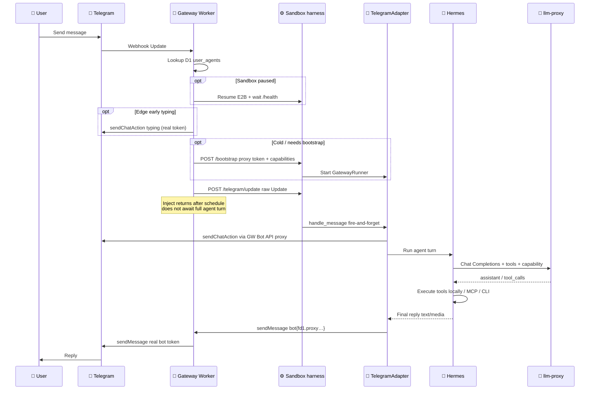

### 5.2 First-user provision path

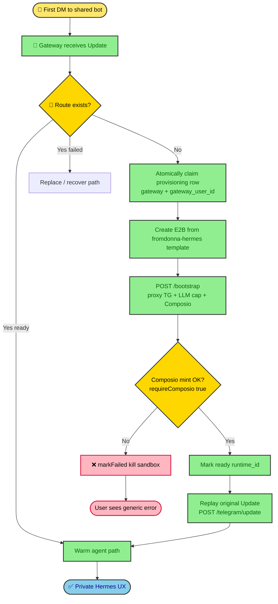

### 5.3 Bot API hard wall (token model)

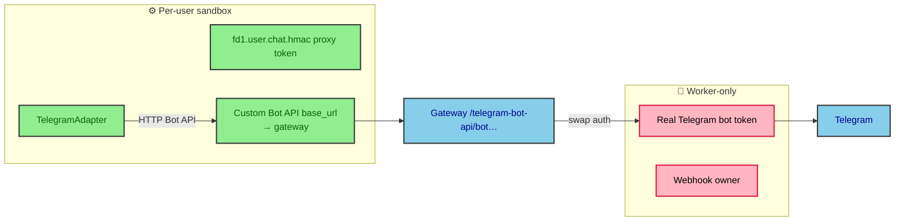

**Proxy token shape:** `fd1.<b64(user)>.<b64(chat)>.<b64(hmac)>`  
**Sandbox env:** `HERMES_TELEGRAM_DISABLE_FALLBACK_IPS=1` when custom base_url is set.

---

## 6. Deployment Architecture

### 6.1 Runtime placement

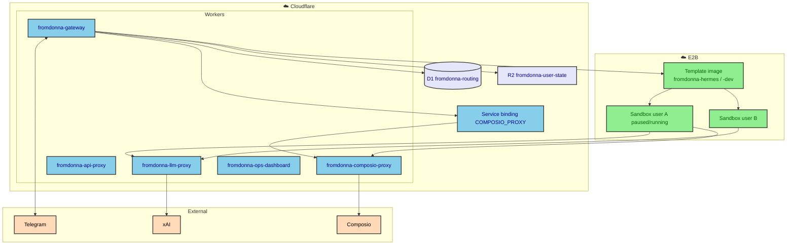

### 6.2 Monorepo → deployables

| Path | Artifact |
|------|----------|
| `cloudflare/gateway` | `fromdonna-gateway` |
| `cloudflare/llm-proxy` | `fromdonna-llm-proxy` |
| `cloudflare/api-proxy` | `fromdonna-api-proxy` |
| `cloudflare/composio-proxy` | `fromdonna-composio-proxy` |
| `E2B-Template/` | Image `fromdonna-hermes` (+ dev tag) via `template.ts` / `deploy-template.sh` |
| `E2B-Template/hermes/` | Vendored Hermes **source fork** baked into image |
| `E2B-Template/harness/` | Sandbox HTTP entry (`/telegram/update`, `/bootstrap`, `/health`) |
| `E2B-Template/config/hermes/` | Product defaults incl. `SOUL.md`, streaming off |

**Sibling (not monorepo agent stack):**
- `donna-page` → fromdonna.com waitlist (KV)
- `donna-apply` → apply.fromdonna.com (D1 applicants)

### 6.3 Sandbox lifecycle

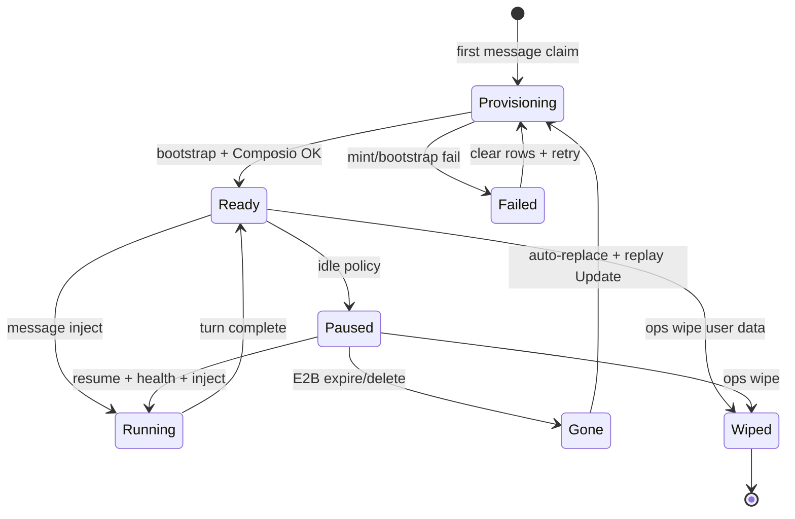

**Data durability rules:**
| Data | Primary home | On sandbox death |
|------|--------------|------------------|
| Hermes brain (`~/.hermes`) | Live disk on sandbox | Lost unless R2 checkpoint restore |
| User files/artifacts | R2 `users/{userId}/` via tools | Survives |
| OAuth sticky session | D1 `user_composio` | Survives |
| Route | D1 `user_agents` | Survives until wipe |

---

## 7. Data Architecture

### 7.1 D1 `fromdonna-routing` (logical)

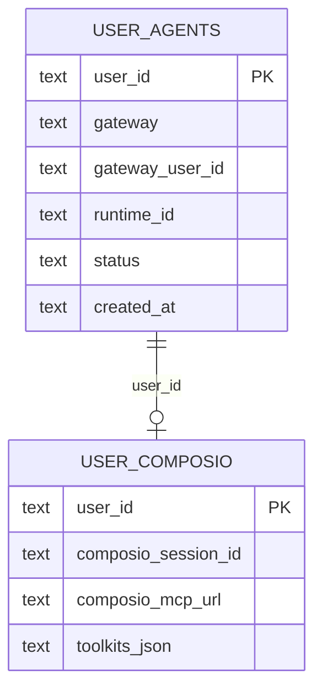

**Phone/route claim:** `gateway` + `gateway_user_id` → `user_id` → `runtime_id` (E2B).

**FK wipe order:** `user_composio` **before** `user_agents`.

### 7.2 R2 `fromdonna-user-state`

- Shared bucket, **per-user prefix** `users/{userId}/`
- Checkpoints (`checkpoint.tar.gz`, manifests) for rebuild/transfer—not continuous primary brain store

### 7.3 Memory philosophy (ICM)

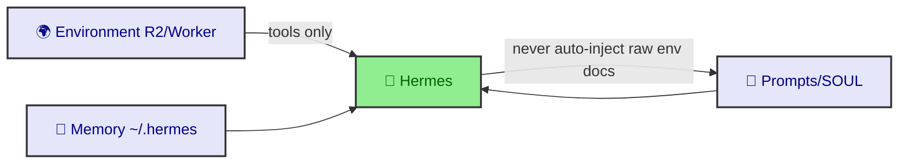

Ojas owns prompting; agents must not silently inject `AGENTS.md` / environment dumps into user turns unless explicitly requested.

---

## 8. Connector / Credential Architecture

### 8.1 Four buckets

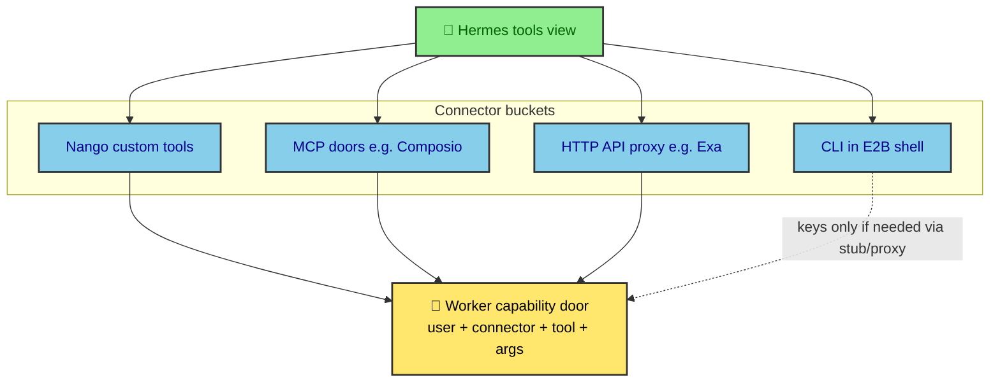

### 8.2 LLM proxy contract

- Sandbox sends **explicit `model`** + **capability token** (HMAC shared `LLM_CAPABILITY_SECRET` on gateway + llm-proxy)
- No server-side default model alias for product traffic
- Must preserve: multipart content, `tools`, assistant `tool_calls`, tool results, streaming, structured outputs
- Provider adapters (Grok/Codex/Responses) stay **Worker-side**; Hermes executes tools

### 8.3 Composio policy

| Moment | `requireComposio` | Behavior |
|--------|-------------------|----------|
| Provision / replaceRuntime | **true** | Fail closed if mint fails |
| Per-message inject | **false** | Soft-fail; warm path may skip bootstrap |
| Token location | process env | `FROMDONNA_COMPOSIO_MCP_TOKEN`; yaml `${…}` only |
| Gateway ↔ proxy | service binding | `COMPOSIO_PROXY` (not public workers.dev fetch) |
| Shared secret | both Workers | `COMPOSIO_SESSION_SECRET` must match |

### 8.4 Secret placement matrix

| Secret | Lives on | Never on |
|--------|----------|----------|
| Telegram bot token | gateway | E2B, git |
| LLM provider keys | llm-proxy | E2B, gateway (beyond capability mint) |
| `COMPOSIO_API_KEY` | composio-proxy | gateway, E2B, git |
| Product API keys | api-proxy | E2B (uses STUB + base_url) |
| Per-user Composio Bearer | harness process env at bootstrap | yaml plaintext, image bake |
| Proxy TG token | minted per user/chat | real token equivalent |

---

## 9. Security Architecture

### 9.1 Trust boundaries

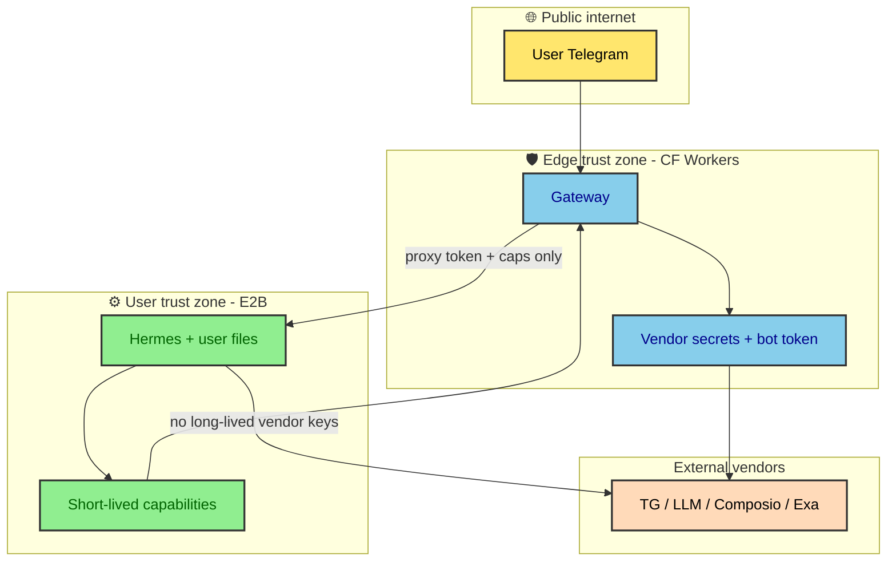

### 9.2 Controls

- **Hard wall** real bot token vs sandbox
- **Capability HMAC** for LLM (and family for other doors)
- **No** `hermes chat -q` stdout bridge (forbidden product path)
- Webhook `allowed_updates` must include **`callback_query`** (buttons)
- Template image: Hermes + harness only—**no real channel tokens baked**

---

## 10. Observability & Ops

| Surface | Role |
|---------|------|
| `dashboard.fromdonna.com` | Turn UI; gateway writes D1 turn rows |
| Harness `/health` | Sandbox ready signal |
| Turn events | `inject.start` → `harness.ready` → `bootstrap.ok|skipped` → `inject.ok` (+ `gateway.early_typing`) |
| Wipe protocol | sandboxes → R2 `users/*` → `user_composio` → `user_agents` |

**Latency diagnosis rule:** pre-typing delay is usually resume/bootstrap, not model TTFT. Measure with real MTProto → `@fromdonna_bot`.

---

## 11. Product UX defaults (architecture-relevant)

| Setting | Value | Why |
|---------|-------|-----|
| TG streaming | **off** | Multi-tool turns can swallow final reply if mid-turn draft marked delivered |
| Default model | `grok-4.5` in template config | Product default; still explicit at proxy call |
| Typing | Hermes `sendChatAction` (+ optional Worker edge early typing) | User sees activity before first token |
| Persona | `E2B-Template/config/hermes/SOUL.md` | Donna PA-with-tools; not host Chitti SOUL |

---

## 12. Explicit non-goals / forbidden designs

1. ❌ Worker as the chat brain or reply rewriter  
2. ❌ `hermes chat --query` / scraping stdout as Telegram UX  
3. ❌ Real bot token in E2B  
4. ❌ Long-lived OAuth/vendor keys in user sandbox disk  
5. ❌ Treating marketing/apply Pages apps as the agent monorepo  
6. ❌ Soft-fail Composio on **provision** (must hard-require)  
7. ❌ Documenting message-only `allowed_updates`  
8. ❌ Auto-injecting environment/ICM docs into every user turn  

---

## 13. Future / not shipped

| Item | Status |
|------|--------|
| WhatsApp Cloud multi-tenant (same proxy philosophy as TG) | Designed, not shipped |
| Full stock Hermes TG parity (media/groups/background) | Partial |
| Nango as primary OAuth path vs Composio | Composio is production OAuth door today |
| Continuous `~/.hermes` primary on R2 | No—live disk primary; R2 for backup/rebuild |

---

## 14. Related internal docs

| Topic | Location |
|-------|----------|
| Gateway / Telegram bridge | `documentation/gateway/*`, skill `references/official-telegram-gateway-bridge.md` |
| LLM proxy | `references/cloudflare-llm-proxy.md` |
| Memory | `documentation/deployment/memorymanagement.md` |
| Connectors | `documentation/tooling/general.md`, `composio.md` |
| CF inventory | `references/cloudflare-inventory.md` |
| Anti-poison | `references/documentation-poison-guards.md` |
| Wipe ops | `references/wipe-and-reprovision-ops.md` |

---

## 15. Diagram index

| # | Section | Type |
|---|---------|------|
| 1 | §3.1 | Context |
| 2 | §4.2 | Component / container |
| 3 | §5.1 | Sequence — warm message |
| 4 | §5.2 | Activity — first provision |
| 5 | §5.3 | Token hard wall |
| 6 | §6.1 | Deployment placement |
| 7 | §6.3 | Sandbox state machine |
| 8 | §7.1 | ER — D1 |
| 9 | §7.3 | ICM tools-only |
| 10 | §8.1 | Connector buckets |
| 11 | §9.1 | Trust boundaries |

---

## 16. Changelog

| Version | Date | Notes |
|---------|------|-------|
| 1.0 | 2026-07-26 | As-built architecture from FromDonna product skill + monorepo conventions |

---

*Generated with `design-doc-mermaid` skill patterns (architecture + deployment + sequence + system-design template). Source of truth remains live code + skill anti-poison rules if this doc drifts.*
